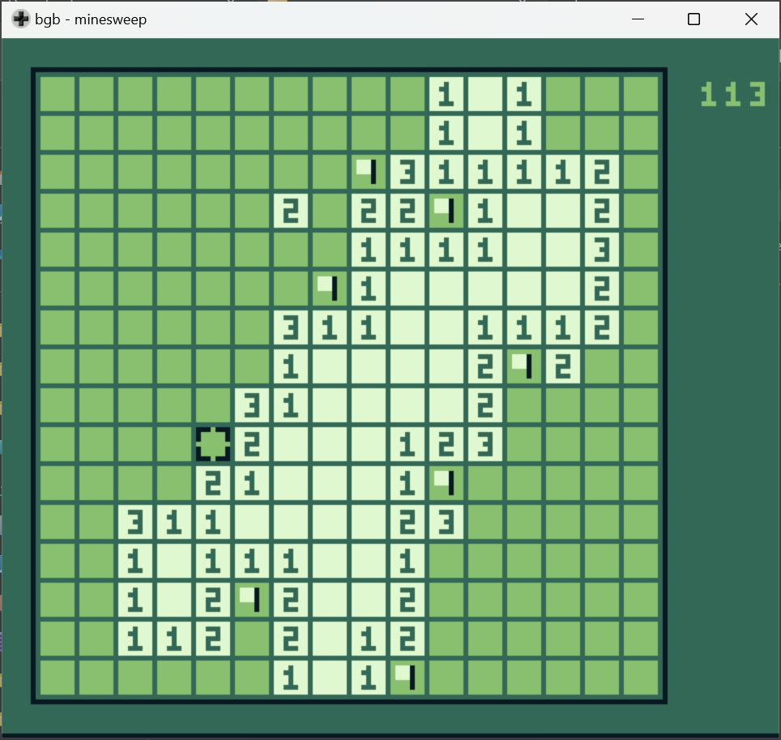

# Games

A bunch of simple games for Game Boy.

## Building

[GBBS](https://github.com/mdagois/gbtools/tree/main/gbbs) is used as the main build system.
Check the requirements to use it.
Note that a copy of `make` is available in the [bin](../bin) directory of the repository.

A batch, `build.bat`, is also available as an additional option to build on Windows.

## List

### Minesweep

A logic puzzle game in which 40 mines are hidden in a 16x16 grid.

### Bustout

