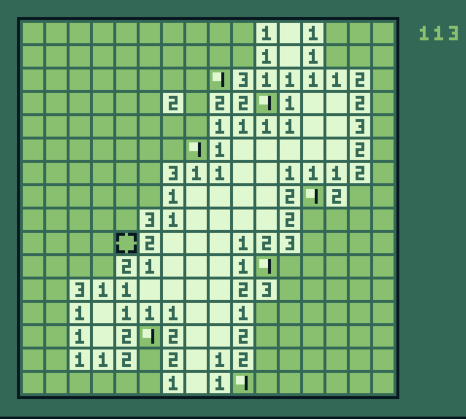
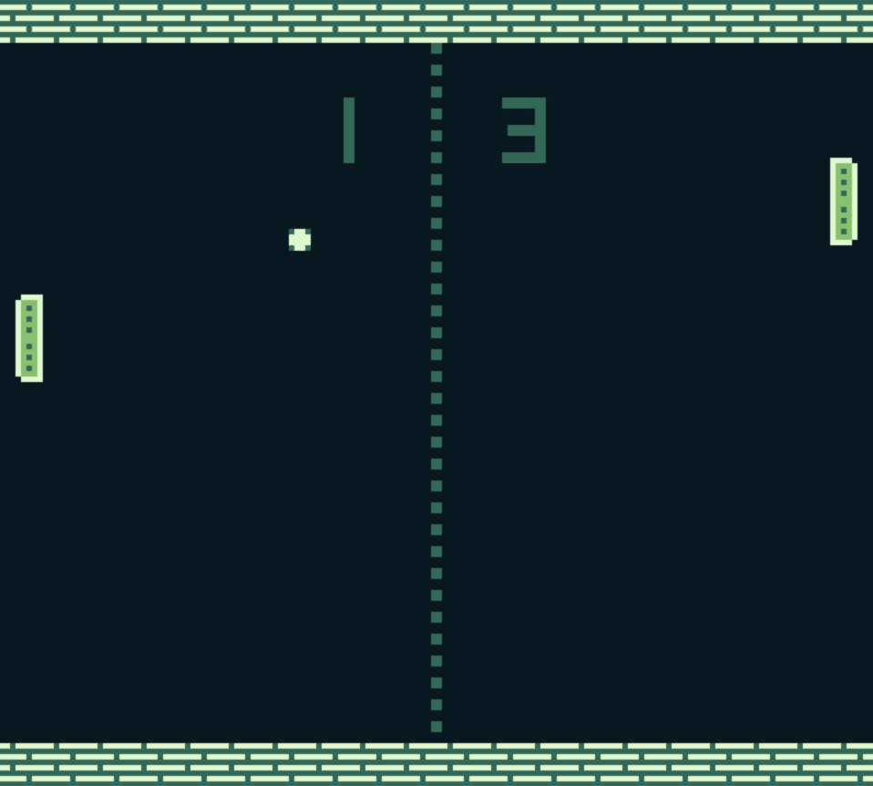

# Games

A bunch of simple games for Game Boy.

## Building

[GBBS](https://github.com/mdagois/gbtools/tree/main/gbbs) is used as the main build system.
Check the requirements to use it.

To build both release and debug versions of all games, just type `make -j`.
Type `make help` to see all the available targets.
Prebuilt release versions of the ROMs are also available in the [prebuilt/games](../prebuilt/games) folder at the root of the repository.

## Projects

Each game has its own folder, containing its specific code and graphics assets.
The `Initialize` and `Update` functions of each game is in a file named `<game_name>.rgbasm`.
For example, for Minesweep, the file is `minesweep.rgbasm`.
This file is a good place to start checking the code.
The [common](common) folder contains the generic code shared by all games.

## List

Here is a list of all games.

### Minesweep

A logic puzzle game in which 40 mines are hidden in a 16x16 grid.

### Pong

A simple pong game.

